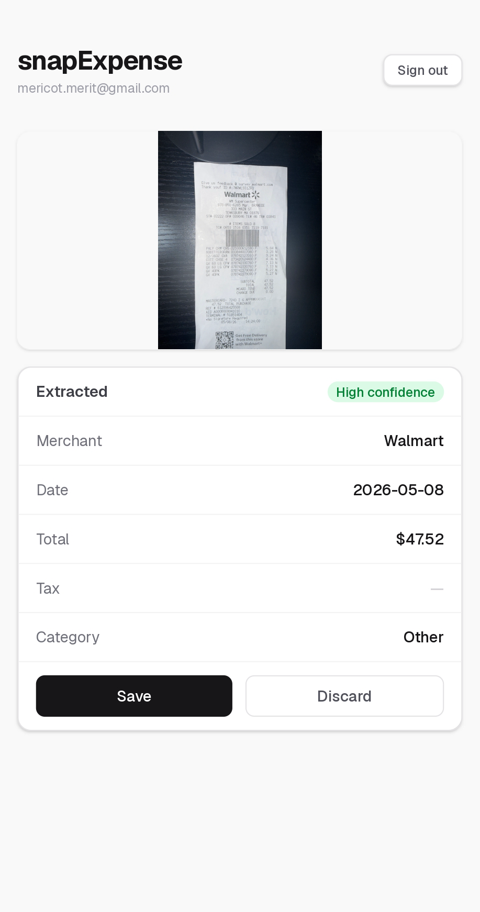

# SnapExpense

**Snap a photo of a receipt. Get clean, private, exportable expense data.**

Live at **[snap-expenses.com](https://snap-expenses.com)**

SnapExpense is a multi-tenant expense tracker for freelancers. Take a photo of
a receipt and Claude's vision model extracts the merchant, date, total, tax,
and category into structured data — no manual entry. Every user's data is
isolated with database-level access control.




## Features

- 📸 **Receipt capture** — camera on mobile, file upload on desktop
- 🤖 **AI extraction** — Claude Haiku 4.5 (vision) reads the receipt and
  returns strict JSON: merchant, date, total, tax, category, confidence
- ✅ **Review before save** — extracted data is confirmed by the user, never
  blindly written
- 🔐 **Private by design** — magic-link auth, per-user data ownership, and
  Postgres Row Level Security enforced in the database itself
- 📊 **Running totals** by category
- 📥 **CSV export** for bookkeeping and tax prep

## Architecture

```
┌──────────┐   photo (base64,      ┌─────────────────┐
│  Next.js │ ─── resized client- ─▶│  /api/extract    │
│  (Vercel)│      side)            │  Claude Haiku 4.5│
└────┬─────┘                       │  (vision → JSON) │
     │                             └────────┬─────────┘
     │  user reviews + saves               strict JSON
     ▼                                      │
┌──────────────────────────────────────────▼──┐
│ Supabase (Postgres)                          │
│ • expenses table, user_id FK → auth.users    │
│ • RLS: user_id = auth.uid() on all 4 verbs   │
│ • Auth: email magic links (SMTP via Resend)  │
└──────────────────────────────────────────────┘
```

**Stack:** Next.js (App Router, TypeScript) · Anthropic API (Claude Haiku 4.5
vision) · Supabase (Postgres, Auth, RLS) · Resend (transactional email) ·
Vercel (hosting) · Cloudflare (DNS)

### Why these choices

- **Vision extraction over OCR-plus-parsing:** one model call returns typed
  JSON with a confidence flag; illegible fields come back `null` rather than
  guessed. Cost is ~$0.0025 per receipt.
- **RLS over app-level filtering:** access rules live in the database, so
  they hold even against direct API calls that bypass the UI. App-level
  `WHERE` clauses alone are cosmetic.
- **Magic links over passwords:** no credentials to store or leak; the email
  inbox is the authenticator.

## Security model

Multi-tenancy is enforced in three layers, bottom-up:

1. **Identity** — Supabase Auth magic links; every request carries a verified
   user ID.
2. **Ownership** — every expense row is stamped with `user_id`
   (foreign-keyed to `auth.users`, default `auth.uid()`).
3. **Enforcement** — Row Level Security policies on select / insert / update
   / delete, all scoped to `user_id = auth.uid()`. Verified with a
   two-account test: a second user sees an empty list, and unauthenticated
   API queries return nothing.

## Running locally

```bash
git clone https://github.com/mericot/snap-expense.git
cd snap-expense
npm install
cp .env.example .env.local   # fill in the three keys below
npm run dev
```

| Env var | Purpose |
|---|---|
| `ANTHROPIC_API_KEY` | Claude API — vision extraction |
| `NEXT_PUBLIC_SUPABASE_URL` | Supabase project URL |
| `NEXT_PUBLIC_SUPABASE_ANON_KEY` | Supabase anon key (RLS makes this safe to expose) |

Database schema and RLS policies live in [`db/`](./db) — run them in the
Supabase SQL editor to reproduce the setup.

## What I learned building this

This was my first end-to-end AI product — built with Claude Code, shipped in
stages, and debugged in production. The full engineering journal is in
[NOTES.md](./NOTES.md). Highlights:

- **Read the logs before theorizing.** A magic-link 500 turned out to be
  SMTP error 535 (bad credential), then 550 (unverified sender domain) —
  each log line named the exact fix, faster than any guessing.
- **"Sender" vs "recipient" in email auth.** A 550 mentioning `icloud.com`
  on mail sent *to* Gmail revealed the misconfigured field was the From
  address — domains you don't own can't be verified senders.
- **DNS is layered.** Registrar → nameservers → records → routing. "It
  doesn't exist," "it isn't mine," and "it isn't configured" are three
  different states, and I hit all three before learning a domain resolving
  to parking IPs means *someone else* owns it.
- **Security belongs in the lowest layer that can't be bypassed.** Auth
  alone isn't privacy; ownership columns alone aren't enforcement. RLS in
  Postgres is what makes the wall real.

## Roadmap

- [ ] Edit/correct a saved expense
- [ ] Monthly summaries and tax-category reports
- [ ] Freemium tier with Stripe (free up to N receipts/month)

## License

MIT
